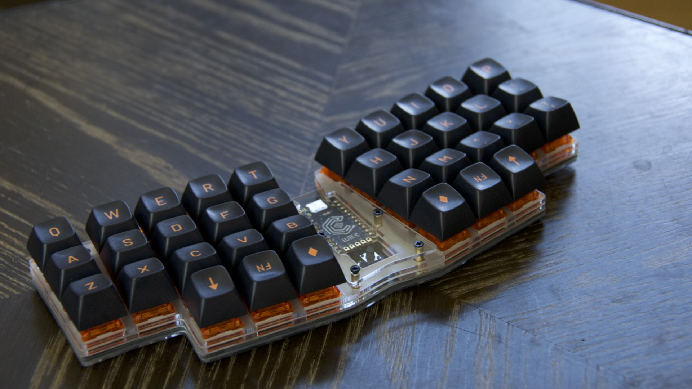
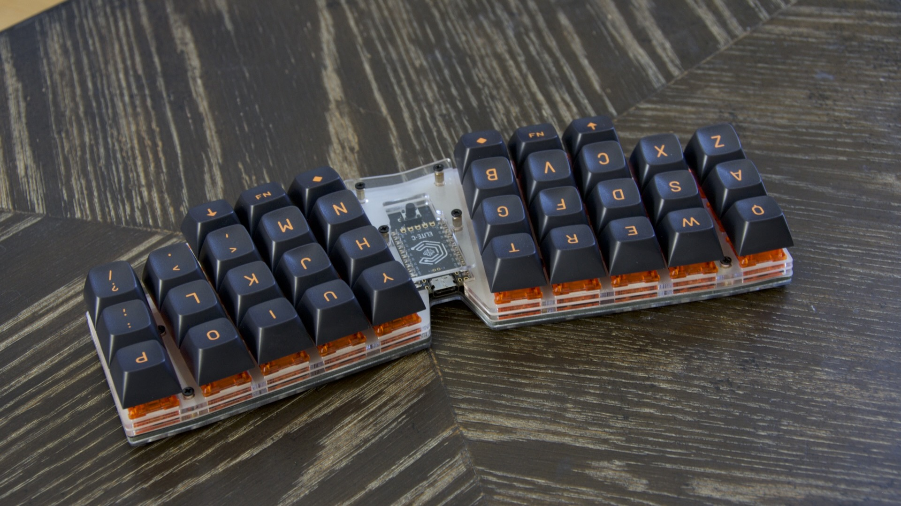
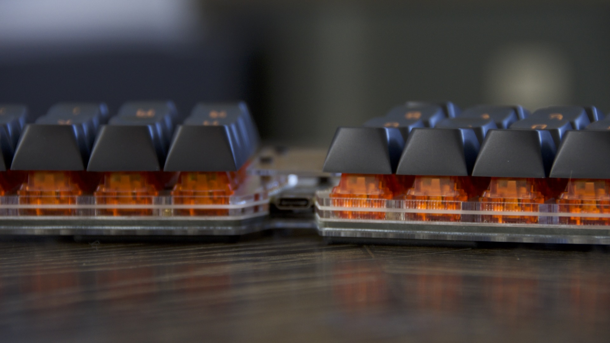
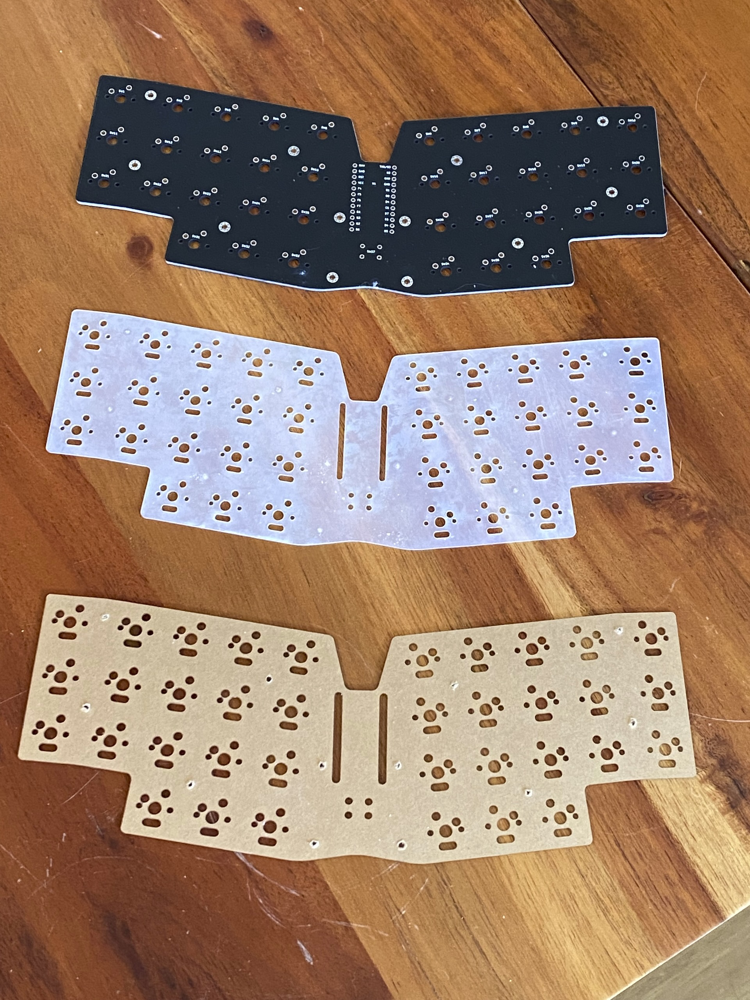

# slabV

A 36 key MX keyboard based on the [Horizon](https://github.com/skarrmann/horizon) 
with an acrylic stacked case featuring multiple full coverage silicone gaskets.

Rather than building up a case of sorts with only PCB's the slabV 
uses the same ideas of tightly formed cutouts from the horizon but
with silicone gaskets and acrylic.  It also adds layers between the 
PCB and the switch tops, also with more gaskets, to produce an
almost completely solid assembly with every mechanical junction
between layers damped with a gasket.

You can see in the image above there is the PCB, with a gasket +
acrylic layer below, and two more acrylic layers with gaskets above. 
The gaskets are the white layers, PCB is black and acrylic is clear.

Here's an image of the pcb, bottom gasket and bottom acrylic 
layer (still with the protective cover).  These examples 
are defective early protoypes, but they 
show the combination of the extra kicad footprints from the
horizon used to cut specific clearance for the underside layers.

This whole stack produces a very solid and pleasingly dampened 
sound which could be described as Thocky if one was so disposed!
It's also about as low profile as can be with full size MX switches.

For complete build information see:
* [build guide](./docs/build_guide.md) 
* [Parts List](./docs/bom.md) 

